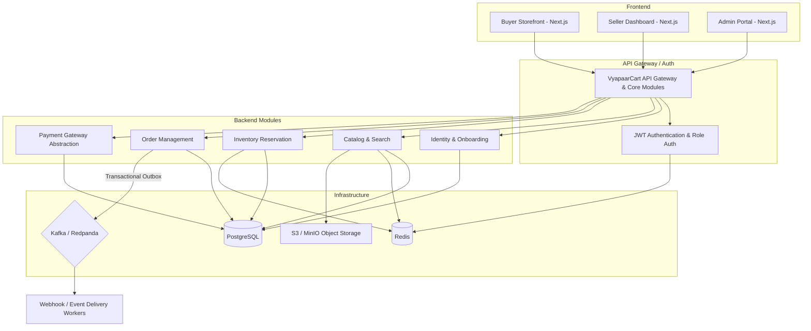
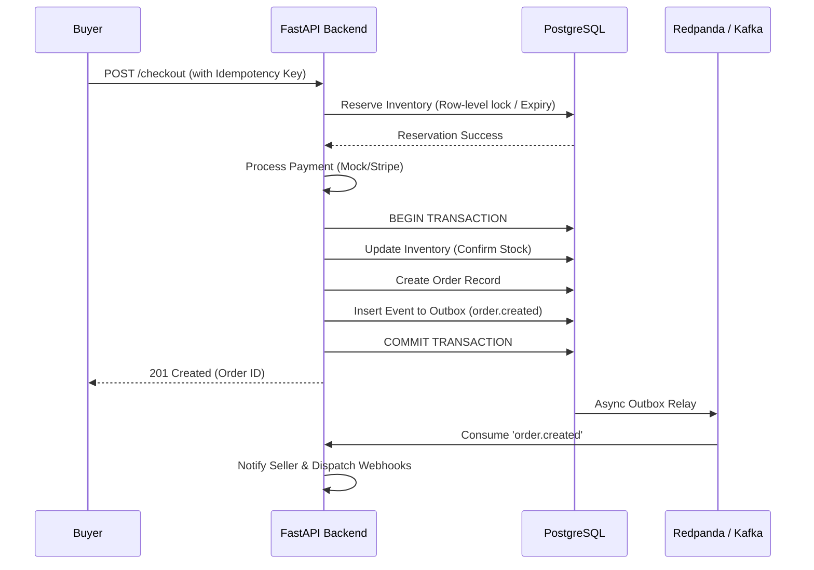
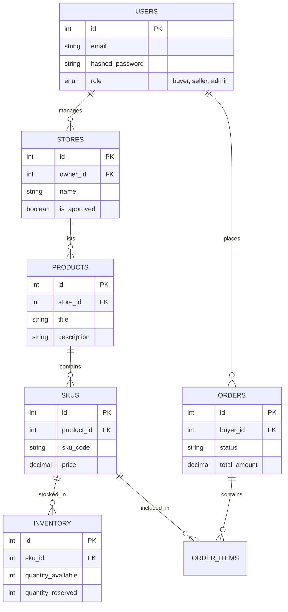

# VyapaarCart — Multi-vendor Marketplace for Independent Sellers

**VyapaarCart** is a robust, multi-vendor e-commerce platform designed for small and independent sellers (Think: Amazon Marketplace + Seller Dashboard). Built with a modern, event-driven backend, the platform enables sellers to seamlessly manage inventory, list products, and fulfill orders while offering buyers a smooth storefront experience.

At its core, VyapaarCart handles high-concurrency inventory reservation, safe payment processing via idempotency, and asynchronous order workflows using a transactional outbox pattern to prevent overselling. 

## 🚀 Product Overview

- **Buyers**: Browse products, search, add items to cart, secure checkout, and track orders.
- **Sellers**: Create stores, manage product listings/SKUs, upload images, manage multi-warehouse inventory, process orders, and view sales metrics.
- **Admins**: Approve sellers, review products, manage disputes, refunds, calculate platform commissions, and monitor system health.

## 🏗️ Architecture

VyapaarCart is built as a **Modular Monolith** using Python and FastAPI, designed to seamlessly evolve into microservices as the product scales.



## 🛠️ Technology Stack

- **Frontend:** Next.js, TypeScript, Tailwind CSS
- **Backend:** Python, FastAPI, Pydantic, SQLAlchemy, Alembic
- **Database:** PostgreSQL
- **Cache & Rate Limiting:** Redis
- **Message Broker:** Kafka or Redpanda
- **Object Storage:** MinIO / AWS S3
- **Containerization:** Docker & Docker Compose
- **Testing:** Pytest (Backend), Playwright (E2E)
- **Observability:** OpenTelemetry, Prometheus, Grafana, Loki (Structured Logs)
- **CI/CD:** GitHub Actions

## 🌊 Event Flow: Checkout & Order Creation

The core checkout process utilizes idempotency, inventory reservation, and a transactional outbox to ensure data consistency.



## 📊 Database Schema (Core Modules)



## 📦 Local Setup Instructions

1. **Clone the repository**
   ```bash
   git clone https://github.com/mhrj7/VyapaarCart.git
   cd VyapaarCart
   ```

2. **Start the core infrastructure (PostgreSQL, Redis, Redpanda, MinIO)**
   ```bash
   docker compose up -d
   ```

3. **Set up the Python environment**
   ```bash
   python -m venv venv
   source venv/bin/activate
   pip install -r requirements.txt
   ```

4. **Run Database Migrations**
   ```bash
   alembic upgrade head
   ```

5. **Start the API Server**
   ```bash
   uvicorn src.api.main:app --reload
   ```

6. **Start the Background Worker** (For outbox processing and webhook delivery)
   ```bash
   python -m src.workers.event_dispatcher
   ```

## 📚 API Documentation

Once the server is running locally, navigate to the auto-generated Swagger UI:
- **Swagger / OpenAPI Specs**: `http://localhost:8000/docs`

## 🧪 Test Strategy

- **Unit Tests**: Isolated testing of business logic (e.g., cart total calculation, role checks).
- **Integration Tests**: `pytest` combined with `testcontainers` for real database and Redis interactions. Validates inventory locking, rate limiting, and transactional outbox inserts.
- **E2E Tests**: Playwright scripts simulating complete user journeys (Buyer checkout, Seller onboarding).

## 📈 Load Testing & Metrics

Load tests are executed using `k6` to stress test the inventory reservation and checkout endpoints to ensure that overselling is impossible under high concurrency. 

*(Note: Actual metrics will be published here once the V1 benchmark is executed on the CI pipeline.)*

## 🚢 Production Deployment Plan

- **Infrastructure as Code**: Terraform to provision AWS resources.
- **Compute**: FastAPI and Worker processes deployed as containers on AWS ECS (Fargate).
- **Database**: Amazon RDS for PostgreSQL (Multi-AZ for high availability).
- **Cache**: Amazon ElastiCache (Redis).
- **Events**: Amazon MSK (Managed Kafka) or Confluent Cloud.
- **Storage**: Amazon S3 for product images.
- **CI/CD**: GitHub Actions pipeline covering linting, testing, Docker image build, and ECS rolling deployments.

## ⚠️ Known Limitations & Next Steps

- **Webhook Infrastructure**: The webhook delivery mechanism (retries, DLQ, replay) currently resides within the VyapaarCart monolith.
- **Next Step**: Extract the webhook delivery and event management system into an independent SaaS project called **HookRelay** to provide dedicated webhook infrastructure.
- **Search**: Currently relies on standard SQL queries. Will integrate Elasticsearch or Typesense for advanced product discovery and filtering.

---
*Built as a scalable, high-performance portfolio project.*
