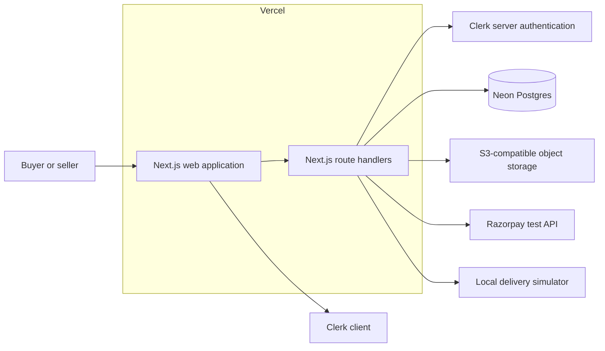
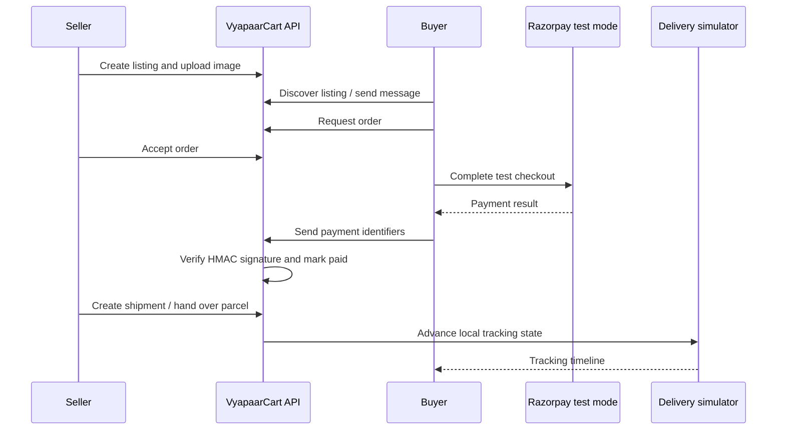
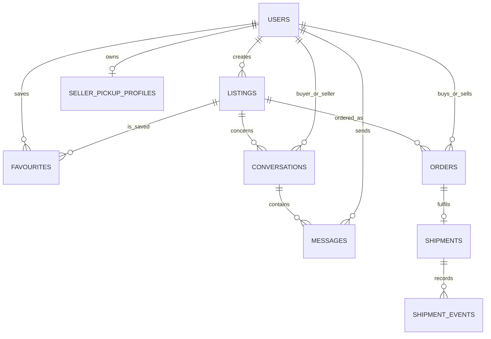
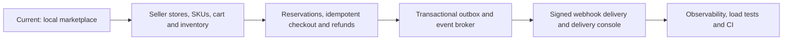

# VyapaarCart

> A full-stack local marketplace for pre-owned goods, built to demonstrate an end-to-end buyer–seller workflow: authenticated listing management, conversations, favourites, test payments, and a delivery lifecycle.

[Live demo](https://vyapaarcart.vercel.app) · [Source code](https://github.com/mhrj7/VyapaarCart)

## Why this project

VyapaarCart models the core workflow of a local marketplace such as OLX: a seller posts a listing, a buyer discovers it, contacts the seller, requests an order, completes a test payment after acceptance, and follows a delivery status timeline. It is deliberately implemented as a modular Next.js application backed by a relational database rather than as a static UI demo.

## Current capabilities

| Area | Implemented behaviour |
| --- | --- |
| Identity | Clerk sign-in with the existing email/social configuration; protected write operations on the server |
| Listings | Create, edit, archive, and delete seller-owned listings; search, category/city/price filters, and sorting |
| Images | Validated JPG, PNG, and WebP uploads up to 5 MB; new listing media is stored through an S3-compatible object-storage adapter and deleted with its listing |
| Product media | Multiple images per product, persisted display order and metadata, seller upload/reorder/removal controls, and a public thumbnail gallery. Failed file deletion retains cleanup metadata for retry. [Implementation and verification](docs/product-media.md) |
| Seller catalog | Approved sellers and assigned staff can manage public stores, categorized products, searchable attributes, and variants with unique SKUs and prices |
| Product search | Public `/products` catalog with indexed title/description relevance, category and seller filters, SQL attribute filtering and bounded pagination. [Design and tests](docs/product-search.md) |
| Marketplace | Favourites, buyer–seller conversations, seller dashboard, and shareable listing pages with metadata |
| Orders | Buyer order requests, seller decision flow, order history, and persisted payment/shipping data |
| Payments | Razorpay test-order creation and server-side HMAC signature verification |
| Delivery | Seller pickup profile, local deterministic shipment simulator, tracking events, and handover state |
| Platform | Neon Postgres schema with foreign keys and indexes; deployed on Vercel |

## Architecture



The application is a **modular monolith**: page modules and typed route handlers share a single database schema. This keeps the project straightforward to run and reason about while leaving natural boundaries for future extraction, such as payment, notifications, and event delivery.

## Core buyer–seller flow



## Data model



The database schema includes ownership relationships, cascading deletes, uniqueness constraints for duplicate buyer/listing orders and shipment identifiers, and query indexes for active listings, conversations, orders, shipments, and tracking events.

## Technology choices

| Layer | Choice | Reason |
| --- | --- | --- |
| Web + API | Next.js 16, React 19, TypeScript | One typed application for UI and server-side route handlers |
| Authentication | Clerk | Managed sign-in and secure server-side identity checks |
| Database | Neon Postgres + Drizzle ORM | Relational integrity with type-safe SQL access and migrations |
| Object storage | S3-compatible API | Provider-independent listing-image storage; works with Cloudflare R2, AWS S3, MinIO, or another compatible provider |
| Test payment | Razorpay | Realistic order creation and signature verification without live charges |
| Hosting | Vercel | Server-rendered Next.js deployment with managed environment variables |

## Local setup

### Prerequisites

- Node.js 22 or newer
- A Neon Postgres database
- An S3-compatible bucket with public read access or a public delivery domain
- A Clerk application
- Razorpay test keys if testing checkout

### Run it

```bash
git clone https://github.com/mhrj7/VyapaarCart.git
cd VyapaarCart
cp .env.example .env.local
npm install
npm run db:push
npm run dev
```

Open `http://localhost:3000`.

### Docker Compose

With Docker Desktop running, copy `.env.example` to `.env.local` and populate the Clerk development keys plus any integrations you want to exercise locally. `DATABASE_URL` is overridden inside Compose, so it always points at the local PostgreSQL service. Then start the local application and PostgreSQL database with:

```bash
docker compose up --build
```

The application is available at `http://localhost:3000`; the database schema is applied automatically to the local Postgres container. Stop the environment with `docker compose down`. Add `-v` only when you intentionally want to remove local database data.

### Environment variables

| Variable | Required for | Notes |
| --- | --- | --- |
| `DATABASE_URL` | Persistent marketplace data | Neon Postgres connection string |
| `S3_ENDPOINT` | Listing-image storage | S3-compatible API endpoint, such as a Cloudflare R2, AWS S3, or MinIO endpoint |
| `S3_REGION` | Listing-image storage | Region; use the provider's documented value (`auto` for Cloudflare R2) |
| `S3_ACCESS_KEY_ID` | Listing-image storage | Server-only access key |
| `S3_SECRET_ACCESS_KEY` | Listing-image storage | Server-only secret key |
| `S3_BUCKET` | Listing-image storage | Bucket name |
| `S3_PUBLIC_BASE_URL` | Public listing images | Public bucket or CDN base URL, without a trailing slash |
| `NEXT_PUBLIC_CLERK_PUBLISHABLE_KEY` | Sign-in UI | Browser-safe Clerk key |
| `CLERK_SECRET_KEY` | Protected API routes | Server-only Clerk key |
| `RAZORPAY_TEST_KEY_ID` | Test checkout | Never use a live key in this project |
| `RAZORPAY_TEST_KEY_SECRET` | Test payment verification | Server-only secret |

Never commit real credentials. Vercel environment variables are used for the deployed application.

## Verification performed

- `npm run build` completes successfully with TypeScript checks.
- `npm run lint` completes with no errors; the only remaining notices are four Next.js image-optimization warnings for user-uploaded image elements.
- Production home page and the public listings endpoint return `200` from the Vercel deployment.
- Database schema was applied to the connected Neon database.

No performance or load-test figures are claimed because they have not yet been measured.

## Intentional current limitations

This repository **does not yet claim** to be the complete multi-vendor commerce platform described in the original roadmap. In particular, it does not yet include:

- Carts or multi-warehouse inventory
- Concurrent inventory reservation, idempotency keys, automatic stock release, or a true oversell-prevention test
- Disputes, refunds, or commission accounting
- Redis rate limiting, Kafka/Redpanda, transactional outbox, email notifications, or OpenTelemetry/Prometheus/Grafana
- Webhook endpoints, HMAC-signed webhook deliveries, retry queues, delivery console, secret rotation, replay, or endpoint-level rate limits
- FastAPI, Alembic, pytest, Playwright, k6, or GitHub Actions CI
- A real courier integration; delivery is a local simulator for safe testable workflows

## Roadmap toward the flagship marketplace



The next highest-value milestone is **inventory reservations with idempotent checkout**. It creates a concrete concurrency problem to solve, makes the data model closer to a true marketplace, and provides the event source needed to build a separate webhook product later.

## Resume-safe project description

Use this now:

> Built and deployed VyapaarCart, a full-stack local marketplace using Next.js, TypeScript, Neon Postgres, Drizzle, Clerk, S3-compatible storage, and Razorpay test mode. Implemented authenticated listing management, public seller stores, categorized products and SKU variants, ordered product galleries, buyer–seller messaging, payment signature verification, and a persisted simulated shipment-tracking workflow.

Do **not** yet claim Kafka, Redis, FastAPI, inventory reservations, real courier integration, webhooks, or measured scale. Add those only after they are genuinely implemented and tested.

## Licence

Built as a personal portfolio project.
