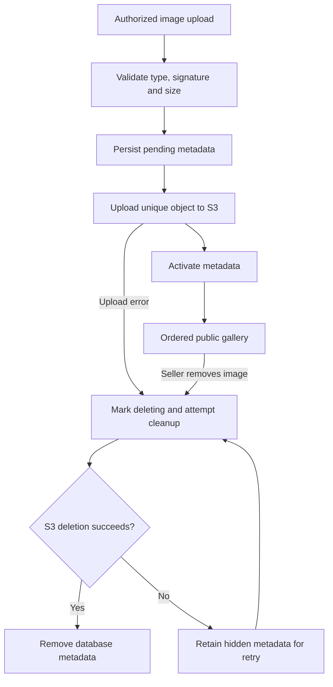

# Ordered product media (M-18)

Products support multiple JPG, PNG, and WebP images. The seller workspace uploads files, sets the display order, and removes unused images. The public store renders active images in that saved order; the first is the cover.

## Data and ownership

`product_images` persists product ID, object key, alt text, MIME type, byte size, position, status, and creation time. Keys are unique. Product deletion is restricted while media records exist, so it cannot silently orphan bucket objects. Storage reuses the existing `listings/<signed-in-user>/<image-uuid>` prefix to preserve the bucket's scoped access policy.

Every management request checks database-backed seller approval and ownership (including authorized staff/admin access). The client cannot select an arbitrary bucket key to delete. Uploads require an allowed MIME type and matching file signature, and are limited to 5 MB per file. This is not a malware scanner or image transcoder.

## Storage lifecycle



An interrupted upload stays pending and never appears publicly. The endpoint has a 60-second execution budget; pending rows can be removed after two minutes. Failed deletion hides the image immediately but retains the object reference until storage deletion succeeds. Cleanup is seller-triggered, not an automatic background sweeper. Already cached copies may remain in browsers/CDNs until expiry; deletion verification checks the storage origin, not those caches.

## API

| Method | `/api/products/:id/images` |
| --- | --- |
| GET | Owner/staff/admin media list, including unfinished cleanup |
| POST | Multipart `image`, optional `altText`; returns persisted metadata and URL |
| PATCH | JSON `imageIds`, an exact permutation of all active images |
| DELETE | JSON `imageId`; deletes the stored file before removing its metadata |

Ordering is a single guarded SQL update. Duplicate, missing, foreign, and stale image sets are rejected; concurrent valid reorders are last-write-wins. Concurrent uploads can share a position; the image ID is the stable tie-breaker until the seller explicitly reorders them.

## Reproducible checks

```bash
npm test
npm run lint
npm run build
# Isolated Compose Postgres only; integration rejects a remote database URL.
docker compose exec -T app sh -c 'RUN_MEDIA_INTEGRATION=1 npx tsx --test tests/product-media.integration.test.ts'
```

The integration test exercises the actual route handlers and local PostgreSQL with a local S3-protocol test server: multi-upload, persisted metadata, order after reload, ownership denial, malformed file rejection, storage deletion failure, successful cleanup retry, and removal of unused files. It does not claim that the local protocol test proves AWS permissions or the production UI. Those need a separate deployed smoke test.
