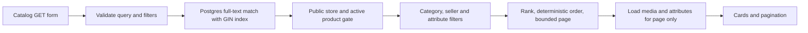

# Product search

M-19 requirement: scalable product search with relevant text, category, and seller filters and tests.

The public `/products` catalog and `GET /api/products` use the same server-side query. This is product catalog search, not the separate legacy listings search on the homepage.



## Contract

| Parameter | Meaning |
| --- | --- |
| `q` | Up to 100 characters. English full-text search in title and description. Title weight A, description B. `websearch_to_tsquery` supports quoted phrases, OR and exclusions. |
| `category` | Exact category slug, up to 60 characters. |
| `seller` | Positive marketplace seller ID, not a store name. Matches all public stores owned by that seller. UI labels use store names. |
| `attributeKey`, `attributeValue` | Optional paired exact attribute filter. Case-insensitive value. Runs in SQL before paging. |
| `limit` | 1–48, default 24. |
| `offset` | 0–10,000, default 0. |

Results contain product metadata, public store metadata, category, relevance, attributes and ordered active media. `pagination` includes `hasMore` and `nextOffset`. Unknown categories/sellers produce empty results. Invalid input returns 400. SQL parameters are bound, not interpolated into query text. Private stores and archived products cannot appear.

Search ranks title matches above equivalent description matches, then uses creation time and product ID to break ties. Without a query, newest products come first. The expression index updates automatically when a title or description changes. No third-party paid search service or manual indexing job is used.

## Migration

`0007_product_search.sql` adds a GIN expression index and a B-tree browse index. Index definitions are also declared in the Drizzle schema. For production use the dedicated nontransactional runner, because concurrent index creation cannot run inside a migration transaction:

```sh
node --env-file=.env.local scripts/migrate-product-search.mjs
```

It requires the intended `DATABASE_URL_UNPOOLED`, does not print credentials, and checks index validity. Apply before releasing the application. Review an invalid index before rerunning; `IF NOT EXISTS` alone does not repair one.

## Verification

```sh
npm test
docker compose exec -T app sh -c 'RUN_SEARCH_INTEGRATION=1 npx tsx --test tests/product-search.integration.test.ts'
```

The opt-in integration test rejects nonlocal databases. It creates two sellers, three stores, two categories, active/private/archived products, and 3,000 unrelated products. It checks title-over-description ranking, stemming, combined category/seller filters, attribute filtering before pagination, nonoverlapping pages, empty results, SQL metacharacters, invalid input, updates and a query plan using the GIN index. It removes only its isolated fixtures.

## Boundaries

English stemming is supported, but typo tolerance, prefix autocomplete, semantic search, SKU text search and attribute text relevance are not implemented. Attributes remain exact filters. Offset pages can shift while products change; use a snapshot/cursor design if this becomes a large, high-churn catalog. No production throughput benchmark or million-product scale claim is made.

References: [Postgres full-text indexes](https://www.postgresql.org/docs/current/textsearch-tables.html), [query parsing and ranking](https://www.postgresql.org/docs/current/textsearch-controls.html).
