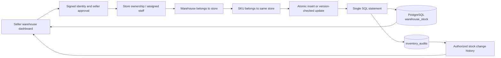

# Warehouses and SKU inventory (M-20, M-21)

Sellers and authorized seller staff can create and edit several warehouses per store. Inventory is stored per product variant (unique SKU) and warehouse, not as a product-wide counter.

## Contract

- `GET /api/stores/:id/warehouses`: authorized store warehouse list.
- `POST` at the same path: create `{name,address,city,postcode}`. Postcode is six digits.
- `GET /api/stores/:id/warehouses/:warehouseId`: warehouse, SKU balances and latest 100 audit records. An unrecorded SKU displays quantity/version zero.
- `PATCH` at the same path: edit warehouse details. Ownership cannot be reassigned.
- `PUT` at the same path: set `{variantId,quantity,version,reason}`. Quantity is an integer between zero and one million. Reason is trimmed, nonempty and at most 240 characters. Legacy clients omitting it receive the explicit reason `Manual stock update`.
- `401`: sign in required. `404`: inaccessible store, warehouse or foreign SKU. `400`: malformed input. `409`: stale stock version; reload before retrying.

The composite primary key prevents duplicate SKU/location balances. A conditional update increments the stock version atomically. Two writers holding the same version cannot silently overwrite one another. A database check rejects negative quantities.

## Stock audit contract (M-21)

Each successful stock write records the authenticated internal actor ID and role, store, warehouse, variant, SKU snapshot, previous quantity, new quantity, stock version, reason and timestamp. Identity comes from the server, never the request body. The UI shows before/after, delta, actor and reason. Initial loads and same-quantity saves are also recorded. Rejected or stale writes do not create successful-change records.

Stock and audit writes are one PostgreSQL data-modifying CTE statement. An audit insertion failure rolls back the stock mutation. Updates lock the current stock row before capturing its previous value, then compare the expected version. A unique warehouse/variant/version audit index prevents duplicate entries. Audit records have no edit/delete application endpoints. This is not a tamper-proof ledger against a database administrator. Stock recorded before this migration has no historical audit and is not backfilled with invented actors or reasons.

## Verification

`npm test` runs input validation. `RUN_WAREHOUSE_INTEGRATION=1 npx tsx --test tests/warehouses.integration.test.ts` requires local PostgreSQL. It applies the tracked migration, creates isolated test records, verifies two warehouse balances for one SKU, seller/staff access, foreign-SKU rejection, persistence, zero stock, database bounds and conflicting simultaneous updates. Test records are removed afterward.

Apply `drizzle/0008_warehouses.sql` using `node --env-file=.env.local scripts/migrate-warehouses.mjs` with the existing direct database URL. This is an additive migration with a short lock timeout. It does not alter existing catalog or checkout data.

For M-21, apply the additive `drizzle/0009_inventory_audits.sql` using `node --env-file=.env.local scripts/migrate-inventory-audits.mjs`. The same local integration test verifies audit actor/reason attribution, previous and new quantities, no records for denied or conflicting writes, staff writes and rollback when audit insertion fails.

## Scope boundaries

These milestones track recorded physical stock and manual change history. They do **not** reserve or decrement stock at checkout, allocate orders or transfer stock. Those are separate inventory requirements. Existing checkout behavior is unchanged. Warehouse addresses, stock and audit history are never exposed in the public product API.
