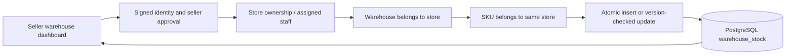

# Warehouses and SKU inventory (M-20)

Sellers and authorized seller staff can create and edit several warehouses per store. Inventory is stored per product variant (unique SKU) and warehouse, not as a product-wide counter.

## Contract

- `GET /api/stores/:id/warehouses`: authorized store warehouse list.
- `POST` at the same path: create `{name,address,city,postcode}`. Postcode is six digits.
- `GET /api/stores/:id/warehouses/:warehouseId`: warehouse and SKU balances. An unrecorded SKU displays quantity/version zero.
- `PATCH` at the same path: edit warehouse details. Ownership cannot be reassigned.
- `PUT` at the same path: set `{variantId,quantity,version}`. Quantity is an integer between zero and one million.
- `401`: sign in required. `404`: inaccessible store, warehouse or foreign SKU. `400`: malformed input. `409`: stale stock version; reload before retrying.

The composite primary key prevents duplicate SKU/location balances. A conditional update increments the stock version atomically. Two writers holding the same version cannot silently overwrite one another. A database check rejects negative quantities.

## Verification

`npm test` runs input validation. `RUN_WAREHOUSE_INTEGRATION=1 npx tsx --test tests/warehouses.integration.test.ts` requires local PostgreSQL. It applies the tracked migration, creates isolated test records, verifies two warehouse balances for one SKU, seller/staff access, foreign-SKU rejection, persistence, zero stock, database bounds and conflicting simultaneous updates. Test records are removed afterward.

Apply `drizzle/0008_warehouses.sql` using `node --env-file=.env.local scripts/migrate-warehouses.mjs` with the existing direct database URL. This is an additive migration with a short lock timeout. It does not alter existing catalog or checkout data.

## Scope boundaries

This milestone tracks recorded physical stock. It does **not** reserve or decrement stock at checkout, allocate orders, transfer stock, or keep a stock movement ledger. Those are separate inventory requirements. Existing checkout behavior is unchanged. Warehouse addresses and stock are never exposed in the public product API.
